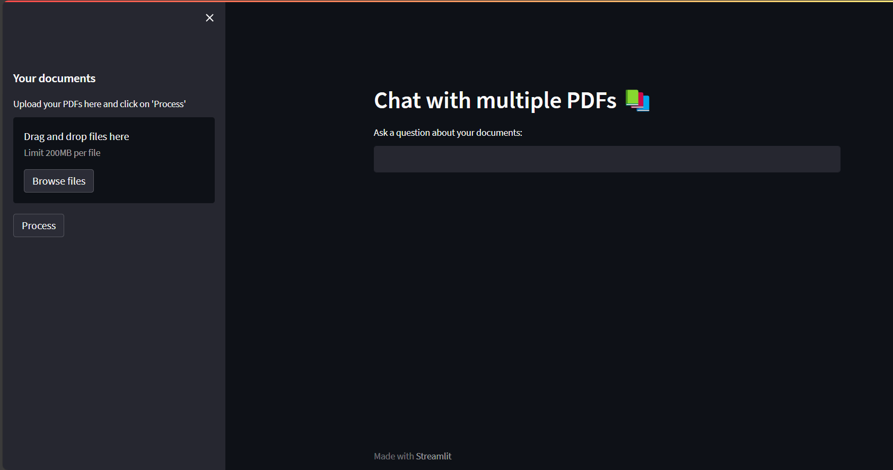

# Chat-with-Documnet
 A chatbot where you can add your PDF's and chat through them.




# Introduction
The MultiPDF Chat App is a Python application that allows you to chat with multiple PDF documents. You can ask questions about the PDFs using natural language, and the application will provide relevant responses based on the content of the documents. This app utilizes a language model to generate accurate answers to your queries. Please note that the app will only respond to questions related to the loaded PDFs.

# How It Works
MultiPDF Chat App Diagram

The application follows these steps to provide responses to your questions:

PDF Loading: The app reads multiple PDF documents and extracts their text content.

Text Chunking: The extracted text is divided into smaller chunks that can be processed effectively.

Language Model: The application utilizes a language model to generate vector representations (embeddings) of the text chunks.

Similarity Matching: When you ask a question, the app compares it with the text chunks and identifies the most semantically similar ones.

Response Generation: The selected chunks are passed to the language model, which generates a response based on the relevant content of the PDFs.

To use this codebase chatbot, follow these steps:

# 1. Clone the repository:

```git clone https://github.com/example/repository.git```

2. Install the required dependencies:

```pip install -r requirements.txt```

3. Set your environment variables in the `.env` file
* Get your HUGGING FACE API TOKEN and add it here

3. Run the Streamlit app:

```streamlit run chatbot.py```
The application will launch in your default web browser, displaying the user interface.

Load multiple PDF documents into the app by following the provided instructions.

Ask questions in natural language about the loaded PDFs using the chat interface.
